# 전자정부 표준프레임워크 포털 사이트 (Spring Boot + Thymeleaf)


> 전자정부 표준프레임워크 5.0 포털사이트(`portal-site-jsp`, Spring + JSP + WAR)를 **Spring Boot + Thymeleaf(JAR)** 로 전환한 프로젝트입니다.
> JSP 원본의 전 기능을 Thymeleaf 화면으로 구현하고, **KRDS(디지털정부 표준 디자인시스템)를 전면 적용**(Bootstrap 프레임워크 제거)했으며, **전 화면 다국어(한국어/English)** 를 지원합니다.

---

## 프로젝트 소개

### 개요

포털 사이트의 커뮤니케이션 기능(게시판, FAQ, Q&A, 설문, 배너, 회원·권한 관리 등)을 전자정부 표준프레임워크 5.0 기반 **Spring Boot + Thymeleaf** 로 제공합니다. 전 화면(203개 템플릿)을 **KRDS(디지털정부 표준 디자인시스템) 네이티브** 마크업으로 전환하고 Bootstrap 프레임워크는 제거했으며, **전 화면 다국어(한국어/English)** 를 적용했습니다(헤더 토글 1클릭 전환). 개발용 DB는 내장 HSQL을 사용하며, 운영용으로 PostgreSQL 등 6종 DBMS의 DDL/DATA·매퍼를 제공합니다.

### 기술 스택

| 항목 | 내용 |
| :--- | :--- |
| 프레임워크 | eGovFrame 5.0 + Spring Boot 3.5 + Thymeleaf |
| 언어 / 빌드 | Java 17 / Maven 3.9.9 (eGovCI-5.0.0 내장) |
| 화면 | Thymeleaf + **공식 KRDS**(디지털정부 표준 디자인시스템, `krds.min.css`) + 호환 레이어(`krds-compat.css`) + **Pretendard GOV** 서체 (전부 로컬, CDN 미사용 / Bootstrap 프레임워크 미사용·아이콘만 유지) |
| 보안 | 세션 기반 Spring Security (`HttpSessionSecurityContextRepository`) |
| 데이터 | MyBatis / 개발=내장 HSQL(파일 영속 `.localdb`) / 운영=PostgreSQL·MySQL·Oracle·Tibero·CUBRID·Altibase |
| 패키징 | 실행 가능 JAR (`java -jar`), 포트 18080 |

---

## 빠른 시작 (Quickstart)

```bash
# 1) 빌드 (eGovCI 내장 Maven/JDK 사용)
export JAVA_HOME="/c/eGovFrame/eGovCI-5.0.0-Windows-64bit/bin/jdk-17.0.17+10"
MVN="/c/eGovFrame/eGovCI-5.0.0-Windows-64bit/bin/apache-maven-3.9.9/bin/mvn"
cd portal-site-boot
"$MVN" clean package -DskipTests

# 2) 실행 (18080 포트)
java -Dfile.encoding=UTF-8 -jar target/egovframe-boot-portal-site-5.0.0.jar --server.port=18080

# 또는 개발 모드
"$MVN" spring-boot:run -Dspring-boot.run.jvmArguments="-Dfile.encoding=UTF-8" -Dspring-boot.run.arguments=--server.port=18080
```

> Windows PowerShell에서 JAR 실행 시 인자는 배열로 전달하세요.
> `& $java @('-Dfile.encoding=UTF-8','-jar',$jar,'--server.port=18080')`

접속: **http://localhost:18080**

### 테스트 계정

| 구분 | 아이디 | 비밀번호 | 권한 |
| :--- | :--- | :--- | :--- |
| 관리자 | `admin` | `1` | ROLE_ADMIN |
| 사용자 | `user` | `1` | ROLE_USER |
| 일반회원 | `user1` | `1` | ROLE_USER |

> 비밀번호 저장 형식 = `Base64(SHA-256(id + 평문))` (`EgovFileScrty.encryptPassword`)

> `admin`/`user`는 업무사용자(USR), `user1`은 일반회원(GNR). 위 3계정은 모두 상태 `P`(승인)이라 즉시 로그인됩니다.
> **새로 셀프 가입(일반·기업)한 계정은 상태 `A`(승인대기)로 저장되어 관리자 승인 전에는 로그인되지 않습니다**(아래 [사용자·회원 모델](#사용자회원-모델) 참조).

---

## 사용자·회원 모델

### 1) 사용자 구분 (USER_SE)

세 종류의 사용자를 각각의 테이블에 저장하고, 뷰 `VW_USER_MASTER`가 세 테이블을 `UNION ALL`로 통합합니다. 식별자는 공통 `ESNTL_ID`(고유ID)로 통일됩니다.

| 구분 | USER_SE | 테이블 | 가입 경로 |
| :--- | :--- | :--- | :--- |
| 업무사용자 | `USR` | `TB_EMPLYR_INFO` | 관리자 직접 등록 |
| 일반회원 | `GNR` | `TB_GNRL_MBER` | 셀프 가입 |
| 기업회원 | `ENT` | `TB_ENTRPRS_MBER` | 셀프 가입 |

> 회원관리 화면 내부에서는 회원구분을 `userTy` 코드(`USR01`=일반·`USR02`=기업·`USR03`=업무사용자)로 다룹니다(목록 컬럼·검색 필터·승인 액션 키). `USER_SE`(GNR/USR/ENT)는 뷰·로그인·마이페이지 식별값입니다.

### 2) 가입 경로

- **일반회원·기업회원** = 셀프 가입. 회원가입 진입점(`EgovMberSbscrbSelect`)에서 **일반회원/기업회원 유형을 선택**한 뒤 각 가입 폼으로 진행합니다.
- **업무사용자** = 셀프 가입 경로 없음. **관리자가 회원관리에서 직접 등록**합니다.

### 3) 승인 정책 (가입 → 승인 → 로그인)

이번 릴리스에서 셀프 가입 승인 정책을 통일했습니다.

- **셀프 가입(일반·기업)은 상태 `A`(가입신청=승인대기)로 저장**됩니다.
- **로그인은 상태 `P`(승인)만 허용**합니다. 로그인 매퍼(`EgovLoginUsr_SQL_*`)가 3유형 모두 상태 컬럼(`MBER_STTUS`/`ENTRPRS_MBER_STTUS`/`EMPLYR_STTUS_CODE`) `= 'P'` 조건을 강제하므로, 상태 `A`는 자동으로 로그인 차단됩니다.
- **관리자가 회원관리 목록에서 신청중(`A`) 회원을 선택해 승인(A→P)**하면 비로소 로그인이 가능합니다.
- **업무사용자는 관리자 등록 시점에 상태 `P`**로 생성됩니다.

> 셀프 가입한 계정이 "가입은 됐는데 로그인이 안 되는" 것은 **승인대기(`A`) 정상 동작**입니다. 관리자 승인 후 로그인하세요.

### 4) 권한그룹 (groupId)과 역할

| groupId | 역할 |
| :--- | :--- |
| `GROUP_00000000000000` | ROLE_ADMIN |
| `GROUP_00000000000001` | ROLE_USER |

- **일반회원 셀프 가입은 `ROLE_USER`로 고정**(`GROUP_00000000000001`, `userTy=USR01`)되어 권한상승을 방지합니다.
- **업무사용자(USR)만 `ROLE_ADMIN` 지정 가능**합니다. 회원 등록/수정 폼(`EgovMberInsert`/`EgovMberSelectUpdt`)의 소속그룹 select는 `userTyForGroup` 모델값에 따라 `ROLE_ADMIN` 옵션을 노출/숨김 처리합니다(일반회원관리 모듈에서는 ROLE_ADMIN 옵션 비노출).

### 5) 회원 구분을 확인하는 위치

1. **마이페이지**(`EgovMberMypage`)의 '회원구분' 항목 — 현재 로그인 사용자의 USER_SE(일반/업무/기업).
2. **`/cmm/user-types`** — 사용자 구분 안내 페이지. 로그인 시 현재 사용자 구분 배지 표시, 세 유형 설명 제공(공개 URL).
3. **회원관리 목록**(`EgovMberManage`)의 '회원구분' 컬럼 — 일반/기업/업무사용자 전 유형을 통합 표시(유형 필터·승인 액션 포함).
4. **DB** — `VW_USER_MASTER.USER_SE`.

### 6) 롤 타입 코드 (COM029)

권한 관리의 롤 등록/수정 화면에서 사용하는 '롤 타입' 드롭다운은 공통코드 **COM029**(`url`/`method`/`pointcut`)로 채워집니다. 컨트롤러 채번 규약은 url→web, method→mtd, pointcut→pct 입니다.

---

## 화면 구성

### 로그인

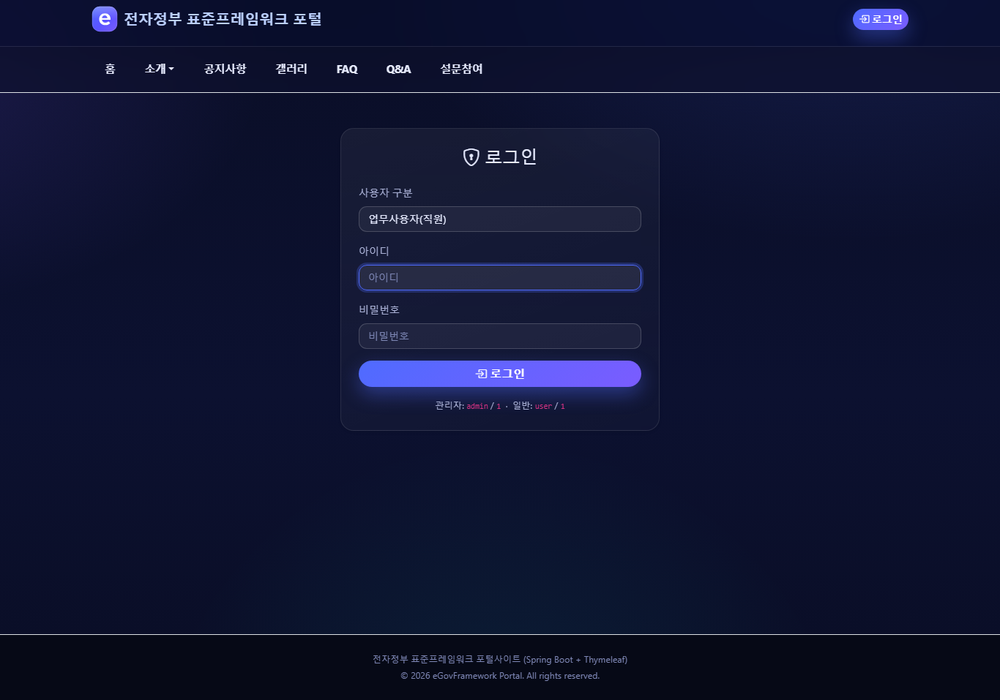

세션 기반 로그인. 로그인 후 권한(관리자/사용자)에 따라 메뉴가 노출됩니다.

### 메인 화면

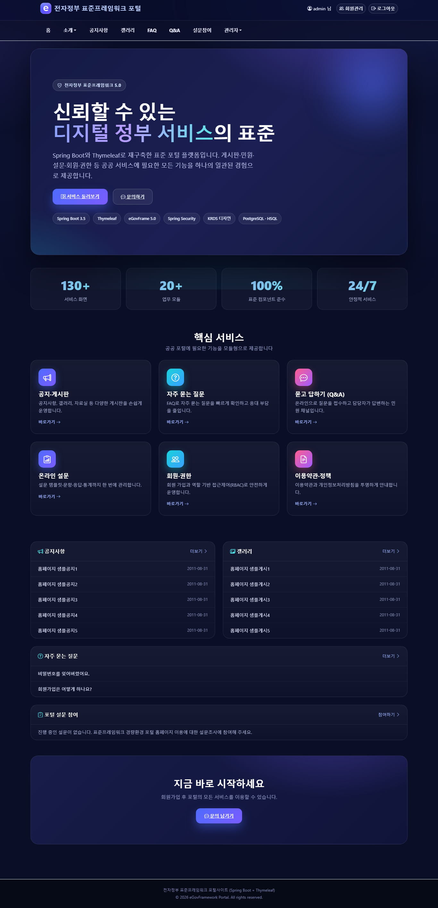

KRDS 다크 테마 랜딩. 공지사항·자유게시판·FAQ·설문참여 요약을 한 화면에 제공합니다.
상단 네비게이션: **홈 · 소개 · 공지사항 · 갤러리 · FAQ · Q&A · 설문참여 · 관리자(관리자 전용)**

### 공지사항 / 갤러리 (게시판)

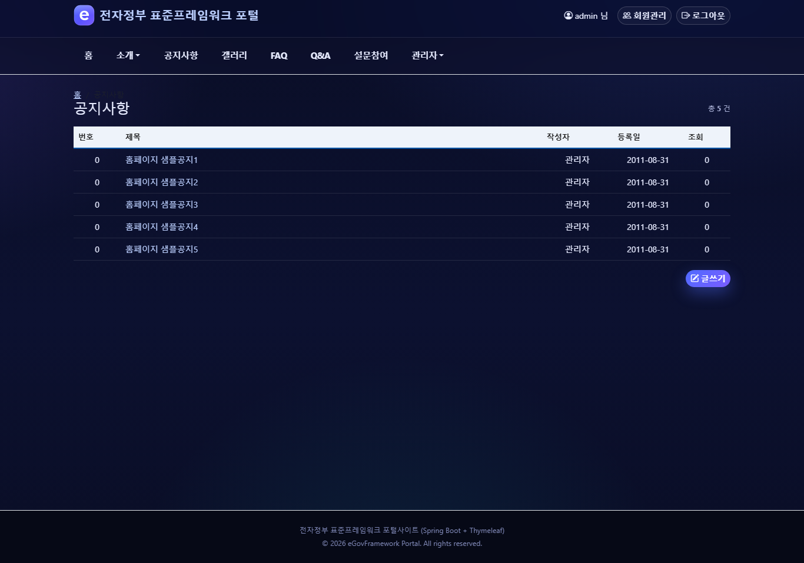

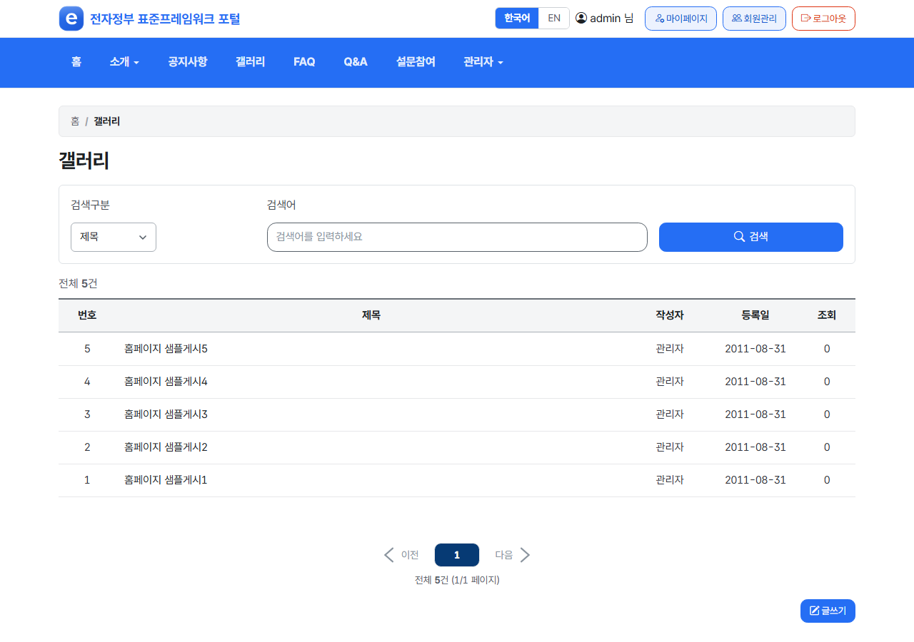

공통컴포넌트 게시판을 커스터마이징. 목록·상세·등록·수정·답글·삭제(논리삭제)와 첨부파일·이미지 미리보기를 지원합니다.

### FAQ / Q&A

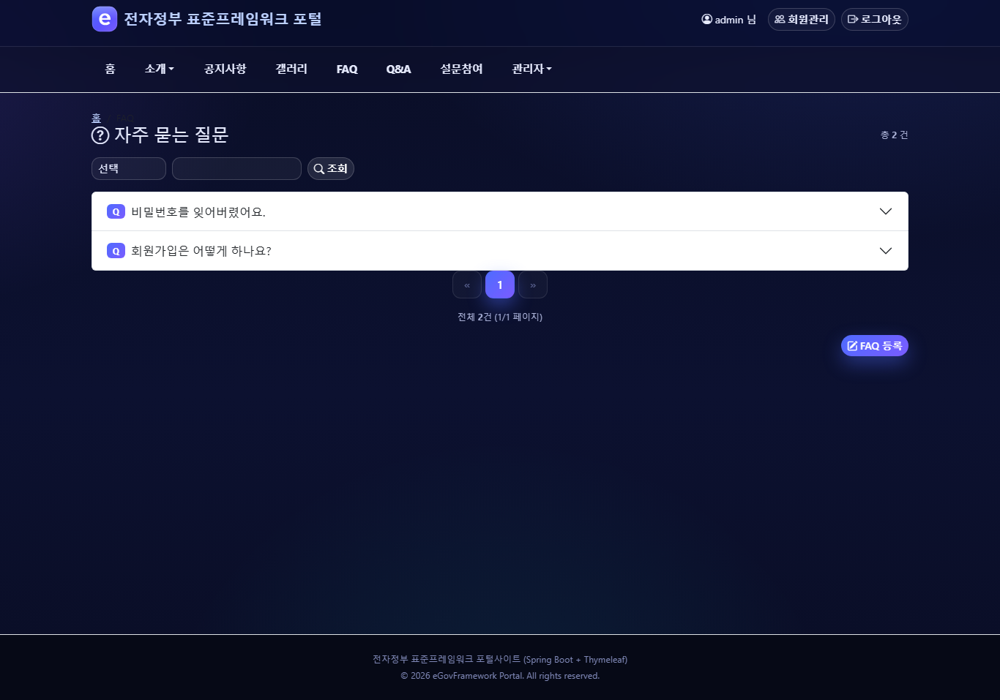

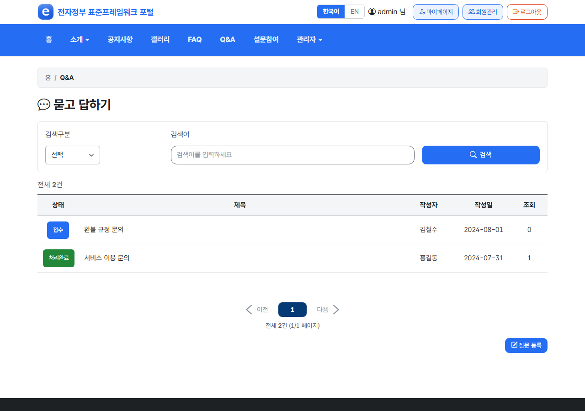

FAQ·Q&A 조회 및 등록. 관리자는 답변 관리가 가능합니다.

### 소개 페이지

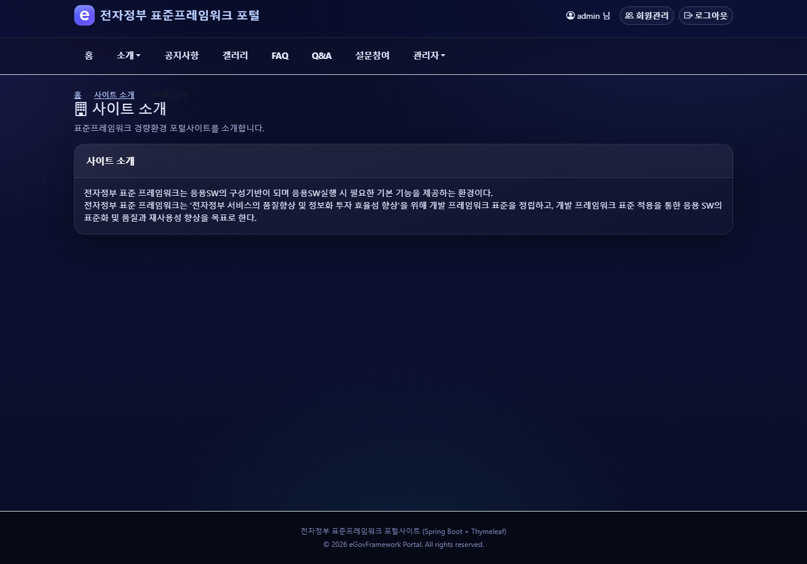

사이트 소개·연혁·조직소개·찾아오시는 길·민원 안내 등 샘플 페이지(`/EgovPageLink.do?linkIndex=N`).

### 회원관리 (관리자)

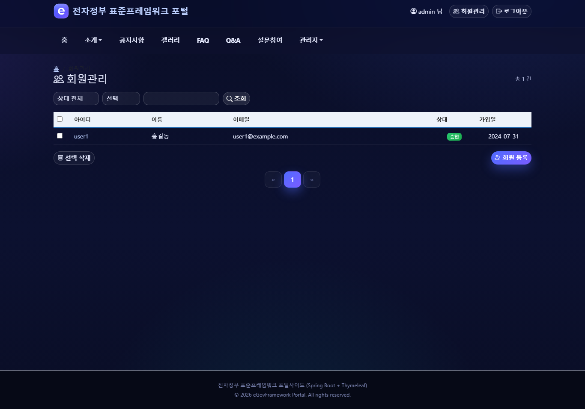

회원 목록·검색·등록·수정·삭제. 관리자 전용.

### 권한관리 (관리자)

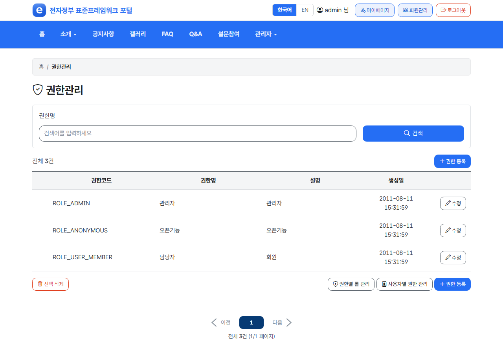

권한·롤·그룹·사용자별 권한 관리. 관리자 전용.

### 설문관리 (관리자)

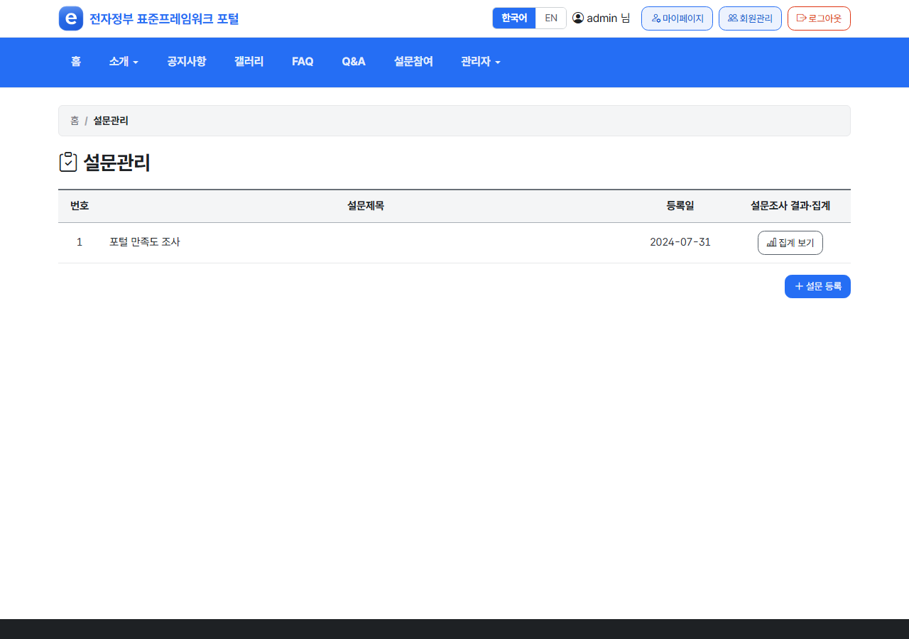

설문(템플릿·설문지·문항·항목·응답결과) 관리. 관리자 전용.

### 배너관리 / 약관관리 (관리자)

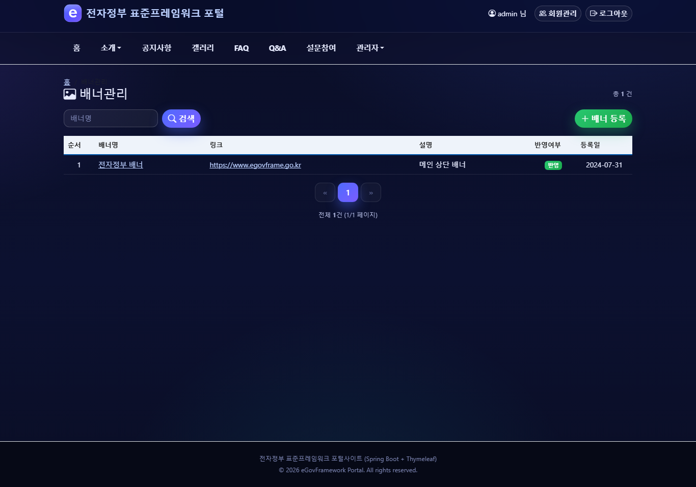

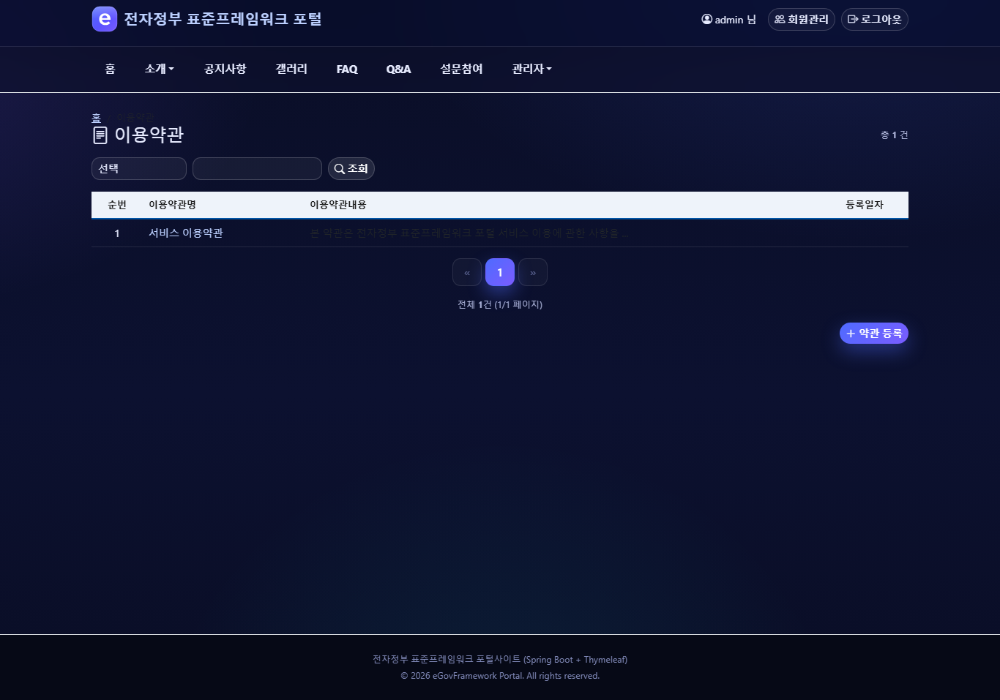

배너·이용약관·개인정보처리방침 관리. 관리자 전용.

---

## 기능 모듈

| 영역 | 기능 |
| :--- | :--- |
| 메인 | 공지·갤러리·FAQ·설문참여 요약, **배너 히어로 캐러셀** 편입 |
| 게시판(cop/bbs) | 공지/갤러리/자료실 CRUD, 답글, 논리삭제, 첨부파일, 게시판마스터·사용정보·템플릿·방명록 |
| 온라인 참여(uss/olh) | FAQ, Q&A (사용자·관리자, 답변관리, **Q&A 상태 색상 배지**) |
| 설문(uss/olp) | 템플릿·설문지·문항·항목·응답·참여 6종 — **모달 문항등록(객관식/서술형)·응답 렌더·검색/필터·참여완료 상태** |
| 약관/방침(uss/sam) | 이용약관·개인정보처리방침(**등록 시 유형 구분**) |
| 회원(uss/umt) | 회원관리, 가입, 비밀번호 변경, **직업유형(OCCP_TY) 필수** |
| 보안(sec) | 권한·롤·그룹·사용자별 권한 |
| 시스템(sym) | **배너(메인/팝업/푸터)**, 우편번호, **달력(격자형)·휴일관리** |

### 이번 릴리스 주요 추가/변경

- **다국어(i18n) 전면 적용**: 전 화면(203개 템플릿)을 한국어/English 메시지 키로 전환(사용자 노출 하드코딩 한글 ≈ 0). 헤더 토글 1클릭 즉시 전환(`/cmm/lang?lang=ko|en` → `LANG` 쿠키 저장 → 직전 페이지 복귀). 메시지 `message-ui_{ko,en}.properties`(ko/en 키 정합). 자세히는 [다국어(i18n)](#다국어-i18n).
- **설문/배너 수정**: 설문 응답 직업코드 컬럼 확장(`OCCP_TY_CODE` varchar(1)→varchar(10), 7종 DBMS — 응답 제출 오류 해소), 응답폼 직업 '전체'(00) 제외(등록폼은 유지), 팝업 배너 홈(메인) 한정 노출.
- **사용자·회원 모델 정립**: 업무사용자(USR)/일반회원(GNR)/기업회원(ENT) 3유형 구분(`VW_USER_MASTER` UNION·`ESNTL_ID` 통합). 셀프 가입(일반·기업)은 상태 `A`(승인대기)로 저장 → 로그인은 `P`(승인)만 허용 → 관리자 승인(A→P) 후 로그인. 일반회원 셀프가입 ROLE_USER 고정(권한상승 방지), 업무사용자만 ROLE_ADMIN. 회원관리 목록을 3테이블 UNION 통합조회로 전환(회원구분 컬럼·유형 필터·승인 액션). 자세히는 [사용자·회원 모델](#사용자회원-모델).
- **KRDS 전면 적용**: 190+ 템플릿을 KRDS 네이티브 마크업으로 전환, Bootstrap 프레임워크 제거(네이티브 + 호환 레이어). 페이지네이션 KRDS 통일(이전/숫자/다음), 게시판 검색폼·전체건수 정렬, Q&A 상태 색상.
- **푸터 심플형 통일**: 공식 홈페이지 배너 + 3컬럼 + 소셜 링크. 소개 페이지 히어로, 전 페이지 '맨 위로' 버튼.
- **배너 기능**: 유형 구분(메인/팝업/푸터), 캐러셀 자동전환(`portal.banner.interval` 기본 5초), 메인 히어로 슬라이드 편입, 팝업(좌표/크기/묶음 · '오늘 하루 보지 않기' 체크 즉시 닫힘 · 로그인 화면 제외), 링크 URL 선택.
- **설문 기능**: 문항(객관식/서술형) 모달 등록 + 아코디언, 응답 페이지 문항 렌더, 설문대상 '전체' 기본, 회원 직업유형 필수, 제목검색 + 회원유형 필터 + 참여완료 상태.
- **달력**: 격자형(일자 밑 휴일 표시·인쇄 시 달력 영역만), 휴일관리 이동 버튼.
- **파일 첨부**: 허용 확장자 화이트리스트 확장(txt/pdf/doc/hwp/zip 등).
- **개발 편의**: HSQL 파일 영속(`.localdb`) + `shtdb.sql` 체크섬 변경 시 자동 재시드(`Globals.localdb.resetEachStart` 토글로 매 기동 강제 초기화 가능).

---

## 데이터베이스

- **개발(기본)**: 내장 HSQL — `src/main/resources/db/shtdb.sql` (DDL+DATA, 40테이블)
- **운영**: `DATABASE/{dbms}/all_pst_ddl_{dbms}.sql`, `all_pst_data_{dbms}.sql`
  - 지원 DBMS: **PostgreSQL · MySQL · Oracle · Tibero · CUBRID · Altibase** (HSQL 포함 7종)
  - 7종 전부 명명규칙 파리티: 각 **DDL 40테이블 · 매퍼 28파일 · 레거시(LETT*/COMVN*) 0건**
- **명명규칙**: 테이블 `TB_` + snake_case 대문자, 모든 테이블 감사컬럼 4종 필수
  (`FRST_REGIST_PNTTM`, `FRST_REGISTER_ID`, `LAST_UPDT_PNTTM`, `LAST_UPDUSR_ID`)
- **DB 전환**: `Globals.DbType`(기본 hsql) + datasource 설정 변경. 매퍼는 `Egov{기능}_SQL_{dbType}.xml`.

표준 규칙 문서: `Docs/단어규칙.md`(표준단어), `Docs/도메인규칙.md`(표준도메인), `Docs/용어규칙.md`(표준용어), `Docs/db-schema-guide.md`.

---

## 다국어 (i18n)

**전 화면(203개 템플릿) 한국어/English 다국어를 지원**합니다. 사용자 노출 텍스트(라벨·버튼·placeholder·제목·검증 메시지 등)는 메시지 키로 외부화되어 있어 하드코딩 한글이 거의 없습니다.

### 사용법

- 화면 우상단 헤더의 **한국어 / EN 토글**을 클릭하면 즉시 전환됩니다(1클릭, 직전 페이지 그대로 유지).
- 선택 언어는 `LANG` 쿠키에 저장되어 이후 접속에도 유지됩니다(기본 한국어).

### 동작 방식

| 요소 | 내용 |
| :--- | :--- |
| 전환 URL | `GET /cmm/lang?lang=ko\|en` (`EgovLangController`) |
| 저장 | `CookieLocaleResolver("LANG")` (`com.security.WebMvcConfig`) — 기본 `ko` |
| 복귀 | 전환 후 **Referer 기준 PRG 리다이렉트**(같은 호스트 경로만, 오픈 리다이렉트 방지) → 최종 URL에 `?lang` 미잔류 |
| 메시지 | `src/main/resources/egovframework/message/message-ui_{ko,en}.properties` |

### 메시지 규약 (신규/변경 화면)

- 노출 텍스트는 **`th:text="#{key}"`** 로 처리(하드코딩 금지). 정적 미리보기로 남는 한글은 렌더 시 치환됩니다.
- 메시지는 **ko/en 동일 키**로 양쪽에 추가(키 집합 일치, 현재 각 1422키). 키 추가는 **APPEND만**(기존 키 변경 금지).
- 한국어 조사·단위(건/명/님/년/월 등)는 영어에서 의도적으로 빈 값으로 두어 자연스럽게 렌더합니다.
- 검증: `comm -3`로 ko/en 키 차이 0 확인, `Cookie: LANG=en` 으로 실제 렌더 시 미해결 키(`??key??`) 0 확인.

---

## 프로젝트 구조

```
portal-site-boot/
├─ src/main/java/egovframework/
│  ├─ com/config/      # Java @Configuration (web.xml/context-*.xml 대체)
│  ├─ com/security/    # 세션 기반 SecurityConfig
│  ├─ com/cmm/         # 공통 VO·서비스·유틸·파일
│  └─ let/{모듈}/web   # 컨트롤러 33종 (cop·uss·sec·sym·uat·main)
├─ src/main/resources/
│  ├─ templates/       # Thymeleaf (layouts/default + fragments + 모듈별 화면)
│  ├─ static/          # 공식 KRDS 킷 + 호환 레이어 (로컬 css/js/images, CDN 미사용)
│  ├─ egovframework/mapper/  # MyBatis 매퍼 (DB타입별 _SQL_{db}.xml)
│  └─ db/shtdb.sql     # HSQL 초기 DDL+DATA
├─ DATABASE/{dbms}/    # 운영 DBMS별 DDL/DATA (6종)
├─ Docs/               # 공통표준 규칙 문서
├─ CLAUDE.md           # 코드베이스 컨텍스트/컨벤션
└─ SKILL.md            # 컨텍스트·하네스 엔지니어링 가이드
```

---

## 참고

- 상세 컨벤션·전환 핵심·함정: [CLAUDE.md](CLAUDE.md)
- 재현 가능한 작업 절차(빌드·검증·DBMS dialect): [SKILL.md](SKILL.md)
- 본 프로젝트는 표준프레임워크 공통컴포넌트 기능 일부를 선정해 구성한 참조용 소스입니다.
- 단독(standalone) 프로젝트입니다. 빌드는 공개 Maven 저장소(`maven.egovframe.go.kr`)의
  `egovframe-boot-starter-parent:5.0.0` 만 참조하며, 다른 로컬 프로젝트에 의존하지 않습니다.

---

## 기여 / 라이선스

- **라이선스**: [Apache License 2.0](LICENSE) — 자유롭게 사용·수정·재배포할 수 있습니다(eGovFramework 기반).
- **오픈소스 고지**: 번들·의존된 서드파티의 라이선스 고지는 [THIRD-PARTY-NOTICES.md](THIRD-PARTY-NOTICES.md) 참조.
  주요: eGovFramework RTE·Spring·Thymeleaf·MyBatis(Apache 2.0), **KRDS**(디지털정부 표준 디자인시스템 — KRDS 이용약관),
  **Pretendard GOV**(SIL OFL 1.1), **Bootstrap Icons**·**Swiper**·**Lombok**(MIT),
  **Andrej Karpathy Guidelines** 스킬(`.claude/skills/karpathy-guidelines/` — MIT, [출처](https://github.com/multica-ai/andrej-karpathy-skills)).
- **표준프레임워크 호환**: eGovFrame 5.x (Spring Boot 3.5)
- **기여 방법**: [Docs/CONTRIBUTING.md](Docs/CONTRIBUTING.md) 및
  [Docs/CONTRIBUTE_README.md](Docs/CONTRIBUTE_README.md) 참고.
  이슈·Pull Request를 환영합니다.
- **보안 취약점 제보**: 공개 이슈가 아닌 비공개 채널로 제보해 주세요
  ([.github/security.md](.github/security.md)).

---

## 문의 (Contact)

- 이메일: **admin@jennysoft.co.kr**
- 이슈·기능 제안: GitHub Issues / Pull Request

---

> 본 코드베이스는 eGovFrame 표준프레임워크 포털 사이트 템플릿을 기반으로, Thymeleaf MVC 화면 계층과 **KRDS 디자인 전환·다국어(한국어/English)·보안/스키마 정비**를 더해 새 프로젝트의 출발점으로 사용할 수 있도록 구성되었습니다.
